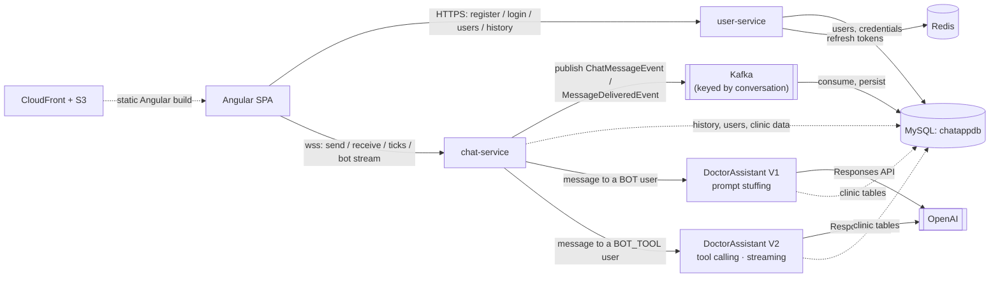
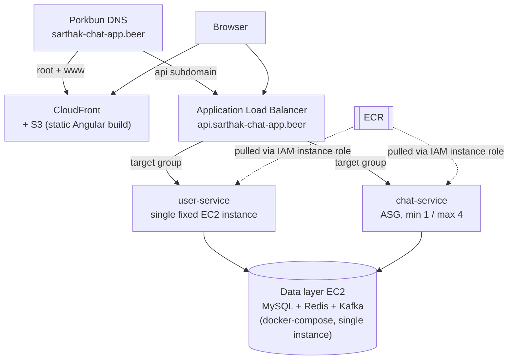

# Chat App

A WhatsApp-style real-time chat application built from scratch as a hands-on
systems-design and AWS learning project, then extended with two LLM-backed
appointment bots built two different ways so their cost and failure modes
could be *measured* against each other rather than argued. Every architectural
choice below was deliberately made and documented, not defaulted into.

**Deployment status:** the AWS stack is **torn down** between demos — an ALB
bills by the hour whether or not anyone uses it, so nothing is left running.
The whole backend is one CloudFormation `create-stack` away (~15 min plus a DNS
repoint, see [AWS deployment](#aws-deployment)); the bots run locally only.
Everything runs in full on a laptop with `docker compose up -d`.

## What it does today

### Human-to-human chat

- Register / log in; see every other user; open a WhatsApp-style **split
  view** — persistent contact list on the left, the open conversation on the
  right, each conversation a bookmarkable `/chat/:userId` URL.
- Live messaging over one WebSocket with **single tick** (server received it)
  and **double tick** (the recipient's device confirmed it) — no read receipts,
  by design.
- Delivery status survives everything: a message sent while the recipient is
  offline is marked delivered by a **reconnect sweep** the moment they next
  connect, and the sender is live-notified if they're still online.
- Persistent history with **cursor-based scroll-back** (50 per page, scroll
  position preserved on prepend), real names in the header, WhatsApp-style
  timestamps.
- Auth: 15-minute JWT access tokens plus **opaque, rotating refresh tokens**
  with reuse detection — replaying a rotated token revokes the whole family.

### DoctorAssistant — two bots, side by side

Both appear in the contact list like any other user and answer the same
conversations against the same clinic (five seeded doctors, four specialties,
deliberately no dermatologist). Describe a symptom; the bot maps it to a
specialty the clinic actually has, offers genuinely free slots, asks you to
confirm, and books.

| | **DoctorAssistant** · V1 | **DoctorAssistant (Tools)** · V2 |
|---|---|---|
| Approach | prompt stuffing — the whole clinic in every prompt | OpenAI **tool calling** — five tools, fetched on demand |
| Reply | one message | **streamed** token-by-token, with "Checking availability…" status while tools run |
| Avg system prompt | 14,915 chars | **3,341 chars** |
| Avg input tokens / turn | 5,536 | **2,768** |
| Latency | 3–6 s | 10–18 s (several sequential API rounds) |
| Availability math | done by the model — got it wrong in live use | done by SQL; the model only receives the answer |
| Whose appointments? | one unattributed list, prompted to be careful | `get_my_appointments` takes **no patient argument** — cross-patient leak is inexpressible |

The pair exists so that comparison is a query over `bot_token_usage`, not a
claim. **In both, the model decides and Java acts** — every booking is
re-validated against live data and a unique constraint before it's written,
so an unreliable model is still a safe one. Every turn is fully reconstructible
from `bot_prompt_log` (one row per turn) and `bot_round_log` (one per API
call).

### Deliberately not there

Read receipts · appointment cancellation · multi-instance live routing (the
connection registry is in-memory) · client-side token refresh (built and
tested server-side; the Angular wiring is the next step) · long-term bot memory
(`previous_response_id` chaining is recovery, not memory) · the bots on AWS.

## Tech stack

| Layer | Technology |
|---|---|
| **Backend** | Java 21, Spring Boot 3.3.4 — `user-service` (stateless HTTP) and `chat-service` (stateful WebSocket, hosts the bots) |
| **Frontend** | Angular 22 (standalone components, signals, RxJS), Node 24 |
| **Real-time transport** | Raw WebSocket with a custom JSON envelope protocol — no XMPP/STOMP |
| **Async messaging** | Apache Kafka 4.3.1 (KRaft, no ZooKeeper), partitioned by conversation |
| **Data** | MySQL 8.0 — one database, `chatappdb`, for users, messages and clinic data; Redis 7 for the refresh-token registry |
| **LLM** | OpenAI **Responses API** via the official `openai-java` 4.52.0 SDK — structured outputs (V1), tool calling + streaming (V2). No Spring AI, deliberately |
| **Auth** | JWT access tokens (15 min) + opaque rotating refresh tokens (7 days, SHA-256-keyed in Redis, family revocation on reuse) |
| **Tests** | 186 JUnit tests across both services (Mockito, AssertJ, H2 for real-query tests, embedded Kafka for the end-to-end ordering test) |
| **Infra** | AWS EC2 + ALB + ASG, CloudFront + S3, ECR, ACM; CloudFormation for all of it |
| **Local dev** | Docker Compose — the entire stack including the Angular dev server; k6 for load testing; Adminer for SQL |

## Architecture



`user-service` is stateless HTTP; `chat-service` is stateful — a live socket
exists in exactly one instance's memory — which is why they're separate
services. The two never call each other; they share only the JWT signing
secret and the database.

The bots are a package inside `chat-service`, not a fourth service: a bot
conversation is one routing branch off the existing WebSocket handler, and
its messages persist **synchronously, bypassing Kafka**, because the bot must
read its own conversation within the same turn. One database rather than two:
`userdb` and `messagedb` were merged into `chatappdb` so the bot can join
users, messages and clinic data in single queries — trading away a
per-service data boundary deliberately ([CLAUDE.md §3.5](CLAUDE.md#35-data-stores)).

## How it was built

Nineteen build-order steps, in nine phases. Each is documented as it was
decided in [`CLAUDE.md`](CLAUDE.md); what broke along the way is in
[`docs/incidents.md`](docs/incidents.md).

| Phase | Steps | What landed |
|---|---|---|
| **1 · Foundation** | 1–4 | Compose skeleton; register, login + JWT issuance; list users |
| **2 · Real-time core** | 5–7, 9 | WebSocket with the token as the first frame; send/receive; single tick; first Angular UI; `delivered_ack` → double tick |
| **3 · Persistence** | 8, 14 | Kafka async persistence keyed by conversation; message-history endpoint |
| **4 · Auth hardening** | 10 | Opaque rotating refresh tokens, reuse detection, family revocation |
| **5 · Capacity & cloud** | 11–12 | k6 load test — found the JVM's 25 % heap default, not container memory, was the ceiling; CloudFormation to EC2 + ALB + ASG, CloudFront, custom domain |
| **6 · Delivery correctness** | 15 | The delivered flag routed through Kafka on the message's own partition key (a real race, fixed structurally); the reconnect sweep |
| **7 · Chat UX** | 16–17 | Real names, timestamps, split view, cursor pagination with scroll preservation |
| **8 · Bot V1** | 18 | Database consolidation; prompt-stuffing bot with structured outputs; token and prompt logs; a cross-patient leak found via those logs and fixed |
| **9 · Bot V2** | 19 | Tool-calling bot alongside V1; streamed replies; per-round logging; the measured comparison above |

Step 13 — wiring the Angular client to `POST /refresh` — is the one step not
yet done.

## AWS deployment



- **VPC: public subnets only, no NAT Gateway** — Security Groups are the
  access-control layer, not network isolation (a NAT Gateway bills a fixed
  ~$32+/month whether used or not).
- **Data layer is one non-scaled EC2 instance** running the same
  docker-compose stack as local dev (MySQL + Redis + Kafka), not three
  separate managed services — an accepted single point of failure,
  consistent with this project's stated "minimize fixed recurring cost"
  posture.
- **Known, deliberately deferred gap**: the chat-service ASG can scale to 4
  instances, but the Redis-backed cross-instance connection registry +
  pub/sub needed to make live message routing actually correct *across*
  multiple instances hasn't been built yet — `ConnectionRegistry` today is
  in-memory and single-instance only. The ASG scales compute capacity today;
  multi-instance correctness is explicit future work, not yet exercised in
  production. Full reasoning: [CLAUDE.md §3.6](CLAUDE.md#36-scaling--infrastructure).
- **Bringing it up from nothing is not yet one command.** The stack creates
  the ECR repos, so a fresh account has no images at first boot (instances
  fail health checks until images are pushed and a tag bump replaces them),
  and CloudFront won't attach the domain aliases until Porkbun's DNS points at
  the new distribution — a manual step CloudFormation can't reach. Splitting
  into a persistent stack (ECR, CloudFront, certs) and a disposable one (VPC,
  ALB, EC2) is the planned fix.

## Notable technical decisions

Full reasoning for all of these (and more) lives in [`CLAUDE.md`](CLAUDE.md),
this project's running architecture-decision log; incident postmortems are
split out into [`docs/incidents.md`](docs/incidents.md).

- **Opaque, rotating refresh tokens instead of a second JWT.** A refresh
  token is checked against a Redis registry on every use anyway, so there's
  nothing to gain from making it self-contained/stateless the way the access
  token needs to be — and an opaque value can't be forged. Reuse of an
  already-rotated token revokes the entire token family, not just the one
  request. ([CLAUDE.md §3.3](CLAUDE.md#33-authentication))
- **Kafka messages are keyed by a canonical, sender-order-independent
  conversation ID** (`min(userId1,userId2):max(userId1,userId2)`), not by
  sender — guaranteeing every message in a conversation, either direction,
  lands on the same partition, which is the only way Kafka's ordering
  guarantee actually applies. The same key is reused for delivery-status
  events, which structurally guarantees a `delivered` update is always
  processed after its message's insert. ([CLAUDE.md §3.4](CLAUDE.md#34-message-persistence))
- **Only `chat-service` auto-scales (ASG, min 1 / max 4); `user-service` is a
  single fixed instance.** A k6 load test empirically found a real
  per-instance WebSocket connection ceiling for chat-service; user-service's
  stateless HTTP load profile has no equivalent scaling pressure to
  demonstrate. ([CLAUDE.md §3.8](CLAUDE.md#38-aws-deployment-architecture-build-order-step-12))
- **A message's live-delivered timestamp and its later history-read
  timestamp are guaranteed identical** — one `Instant.now()` is minted per
  message and shared between the Kafka-persisted event and the live
  WebSocket envelope, rather than two independent clock reads that could
  disagree by milliseconds.
- **Cursor-based pagination (`?before=<timestamp>`), not offset**, for
  scroll-back message history — the access pattern is "page backward while
  new messages keep arriving at the live end," exactly where offset
  pagination silently skips/duplicates rows at a page boundary.
- **The naive bot was built first, on purpose.** V1's prompt stuffing was
  chosen knowing it would hit prompt bloat, so that V2's tool calling solves a
  problem with numbers attached rather than a described one. ([CLAUDE.md §3.9](CLAUDE.md#39-doctorassistant-bot--version-1-build-order-step-18))
- **The model requests; Java decides.** No bot can write to the database.
  Every booking is re-validated against live data, then protected by a unique
  constraint — which is why a demonstrably unreliable V1 was still safe to
  run. And the strongest argument for tools is structural, not statistical:
  V2's `get_my_appointments` accepts no patient id, so the leak V1 had to be
  *prompted* against cannot be expressed at all. ([CLAUDE.md §3.10](CLAUDE.md#310-doctorassistant-bot--version-2-tool-calling-build-order-step-19))

## Docs and diagrams

- [`CLAUDE.md`](CLAUDE.md) — the architecture-decision log, kept current as decisions are made
- [`docs/incidents.md`](docs/incidents.md) — postmortems: the JVM heap ceiling, the CloudFormation-bypass deploy, the template size limit
- [`docs/kafka-design.md`](docs/kafka-design.md) — the delivery-correctness design (reconnect sweep + Kafka-ordered writes)
- [`docs/diagrams/`](docs/diagrams/) — three projector-ready diagrams: Kafka partitioning, refresh-token rotation, the async-write consistency window
- [`docs/bot-requirements.md`](docs/bot-requirements.md) · [`docs/bot-v1-structure.md`](docs/bot-v1-structure.md) — the bot's source requirement and a map of where each piece lives
- [`docs/openai-postman-guide.md`](docs/openai-postman-guide.md) + [`postman/`](postman/) — a Postman playground for the two OpenAI APIs the bots use

## Local setup

Requires Docker and Docker Compose.

```bash
git clone <this-repo>
cd chat-app
docker compose up -d
```

That is the whole stack: MySQL, Redis, Kafka, `user-service` (`:8081`),
`chat-service` (`:8082`) and the Angular dev server (`:4200`). Nothing needs to
be started separately, and everything carries `restart: unless-stopped`, so a
crash or a Docker Desktop restart brings it back on its own.

The first run installs the frontend's dependencies inside the container and
takes a few minutes; later starts are quick. Source is bind-mounted, so editing
a component still hot-reloads.

The app is served at `http://localhost:4200`. Register a couple of users to
start a conversation.

### Enabling the DoctorAssistant bots

The stack runs fine without this — both bots just reply that they are
unavailable. To turn them on, give them an OpenAI API key:

```bash
cp .env.example .env
```

Then edit `.env` and set `OPENAI_API_KEY=sk-...`. `.env` is gitignored; Docker
Compose reads it automatically from the project root. Pick up the change with:

```bash
docker compose up -d --force-recreate chat-service
```

Both bots are seeded as users — **DoctorAssistant** (V1, badged *Prompt
stuffing*) and **DoctorAssistant (Tools)** (V2, badged *Tool calling*) — so
they show up in the contact list next to everyone else. Ask each the same
thing and compare. Five demo doctors across four specialties are seeded on
first boot; there is deliberately no dermatologist, so asking for one
exercises the "we don't offer that" path.

Token cost per turn is recorded in `chatappdb.bot_token_usage` — the point of
building both:

```bash
docker exec chat-app-mysql mysql -uroot -proot -e "SELECT turn_number, input_tokens, output_tokens, total_tokens, model FROM chatappdb.bot_token_usage ORDER BY id;"
```

### Inspecting the database

A browser-based SQL client, behind an opt-in profile so it does not join the
default stack:

```bash
docker compose --profile tools up -d adminer
```

Then open <http://localhost:8083/?server=mysql&username=root&db=chatappdb>,
which preselects everything but the password (`root`).

Use that link rather than the bare URL: Adminer encodes the driver as the query
parameter's *name*, so `?server=` selects MySQL. Left on **MS SQL** the login
fails with `TDS server is unavailable`, which is a driver error, not a database
one.

> **Note:** the database consolidation means an existing local volume from
> before this change still has the old `userdb`/`messagedb`. Run
> `docker compose down -v` once to drop it and start fresh.

To run the backend services natively instead of in Docker (e.g. from an
IDE), see the `application.yml` in each of `user-service/` and
`chat-service/` for the native-run defaults.
