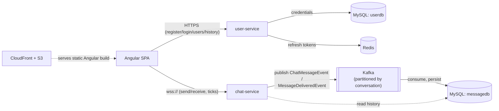
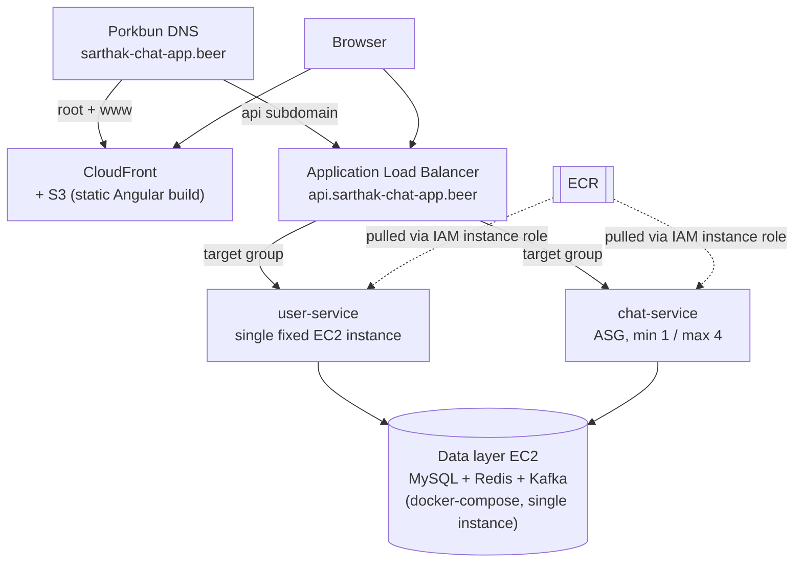

# Chat App

A WhatsApp-style real-time chat application built from scratch as a hands-on
systems-design and AWS learning project — every architectural choice below
was deliberately made and documented, not defaulted into.

**Live demo:** [sarthak-chat-app.beer](https://sarthak-chat-app.beer)

## What it does

An internal-style chat tool for a fixed user base: register, log in, see a
list of other users, and start a WhatsApp-style conversation with single/
double message-delivery ticks, persistent message history, and infinite
scroll-back through older messages — all delivered over a real-time
WebSocket connection backed by an async, Kafka-mediated persistence
pipeline.

## Tech stack

| Layer | Technology |
|---|---|
| **Backend** | Java 21, Spring Boot (two services: `user-service`, `chat-service`) |
| **Frontend** | Angular 22 (standalone components, signals, RxJS) |
| **Real-time transport** | Raw WebSocket with a custom JSON message/ack protocol (no XMPP/STOMP) |
| **Async messaging** | Apache Kafka (KRaft mode, no ZooKeeper) |
| **Data stores** | MySQL (users + messages, two logical DBs), Redis (refresh-token registry) |
| **Auth** | JWT access tokens (15 min) + opaque, rotating refresh tokens (7 days, Redis-backed, reuse-detection) |
| **Infra** | AWS EC2 + ALB + ASG (chat-service auto-scales, user-service doesn't), CloudFront + S3 (frontend), CloudFormation (IaC) |
| **Local dev** | Docker Compose (mirrors the cloud topology) |

## Architecture



`user-service` is stateless HTTP (register/login/list users); `chat-service`
is stateful (holds live WebSocket connections). They're split because they
scale differently — see below.

## AWS deployment



- **VPC: public subnets only, no NAT Gateway** — Security Groups are the
  access-control layer, not network isolation (a NAT Gateway bills a fixed
  ~$32+/month whether used or not).
- **Data layer is one non-scaled EC2 instance** running the same
  docker-compose stack as local dev (MySQL + Redis + Kafka), not three
  separate managed services — an accepted single point of failure,
  consistent with this project's stated "minimize fixed recurring cost"
  posture.
- **Known, deliberately deferred gap**: the chat-service ASG can scale to 4
  instances, but the Redis-backed cross-instance connection registry +
  pub/sub needed to make live message routing actually correct *across*
  multiple instances hasn't been built yet — `ConnectionRegistry` today is
  in-memory and single-instance only. The ASG scales compute capacity today;
  multi-instance correctness is explicit future work, not yet exercised in
  production. Full reasoning: [CLAUDE.md §3.6](CLAUDE.md#36-scaling--infrastructure).

## Notable technical decisions

Full reasoning for all of these (and more) lives in [`CLAUDE.md`](CLAUDE.md),
this project's running architecture-decision log; incident postmortems are
split out into [`docs/incidents.md`](docs/incidents.md).

- **Opaque, rotating refresh tokens instead of a second JWT.** A refresh
  token is checked against a Redis registry on every use anyway, so there's
  nothing to gain from making it self-contained/stateless the way the access
  token needs to be — and an opaque value can't be forged. Reuse of an
  already-rotated token revokes the entire token family, not just the one
  request. ([CLAUDE.md §3.3](CLAUDE.md#33-authentication))
- **Kafka messages are keyed by a canonical, sender-order-independent
  conversation ID** (`min(userId1,userId2):max(userId1,userId2)`), not by
  sender — guaranteeing every message in a conversation, either direction,
  lands on the same partition, which is the only way Kafka's ordering
  guarantee actually applies. The same key is reused for delivery-status
  events, which structurally guarantees a `delivered` update is always
  processed after its message's insert. ([CLAUDE.md §3.4](CLAUDE.md#34-message-persistence))
- **Only `chat-service` auto-scales (ASG, min 1 / max 4); `user-service` is a
  single fixed instance.** A k6 load test empirically found a real
  per-instance WebSocket connection ceiling for chat-service; user-service's
  stateless HTTP load profile has no equivalent scaling pressure to
  demonstrate. ([CLAUDE.md §3.8](CLAUDE.md#38-aws-deployment-architecture-build-order-step-12))
- **A message's live-delivered timestamp and its later history-read
  timestamp are guaranteed identical** — one `Instant.now()` is minted per
  message and shared between the Kafka-persisted event and the live
  WebSocket envelope, rather than two independent clock reads that could
  disagree by milliseconds.
- **Cursor-based pagination (`?before=<timestamp>`), not offset**, for
  scroll-back message history — the access pattern is "page backward while
  new messages keep arriving at the live end," exactly where offset
  pagination silently skips/duplicates rows at a page boundary.

## Local setup

Requires Docker and Docker Compose.

```bash
git clone <this-repo>
cd chat-app
docker compose up -d
```

This brings up MySQL, Redis, Kafka, `user-service` (`:8081`), and
`chat-service` (`:8082`). Then run the frontend separately:

```bash
cd frontend
npm install
npm start
```

The app is served at `http://localhost:4200`. Register a couple of users to
start a conversation.

To run the backend services natively instead of in Docker (e.g. from an
IDE), see the `application.yml` in each of `user-service/` and
`chat-service/` for the native-run defaults.
