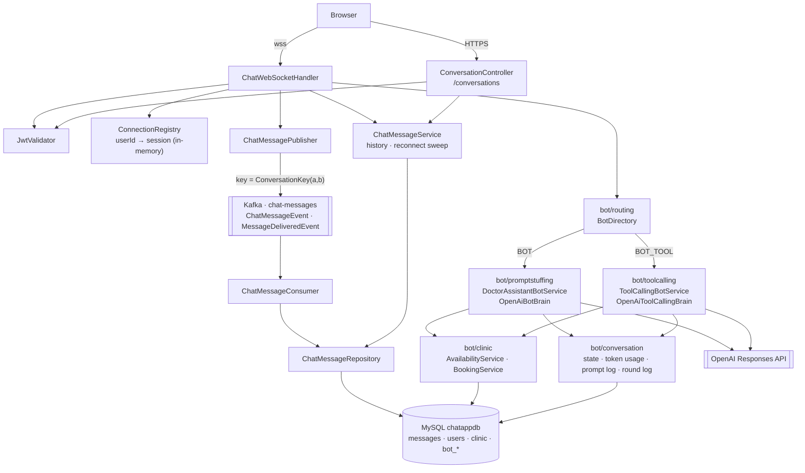
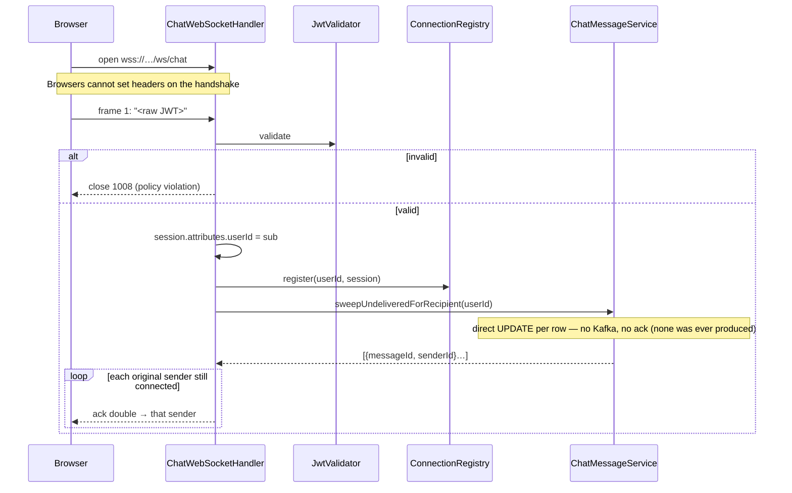
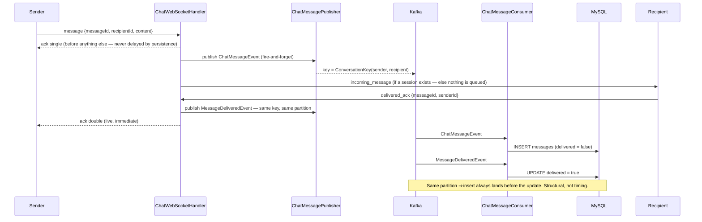
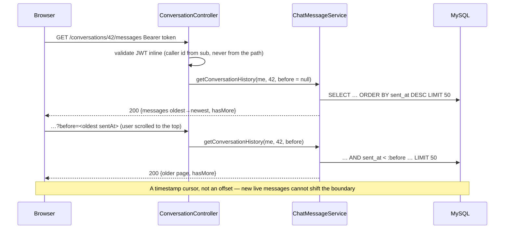
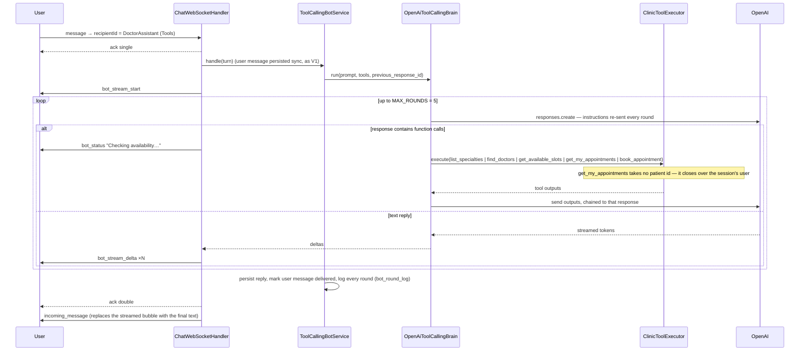

# chat-service

The real-time service: it **holds every live WebSocket**, routes messages,
owns the tick protocol, persists through Kafka, serves history, and hosts both
DoctorAssistant bots. **Stateful** — a live socket exists in exactly one
instance's memory — which is why it is a separate service from user-service,
and why it does not yet scale past one instance (see §Limits).

Port `8082` locally (`8080` inside). Design reasoning: [`CLAUDE.md`](../CLAUDE.md)
§3.1 (protocol), §3.4 (Kafka), §3.9–3.10 (bots), §4 (flows).

## Surface

| Kind | Path / type | Does |
|---|---|---|
| WebSocket | `/ws/chat` | One connection per logged-in user; first frame is the raw JWT |
| WS in | `message` | Send to `recipientId` |
| WS in | `delivered_ack` | Recipient's client confirming an `incoming_message` |
| WS out | `ack` (`single` / `double`) | Tick updates to the sender |
| WS out | `incoming_message` | A delivered message |
| WS out | `bot_stream_start` / `bot_stream_delta` / `bot_status` | The tool-calling bot's reply, streamed |
| REST | `GET /conversations/{otherUserId}/messages?before=` | History, 50 per page, cursor-paginated |
| REST | `GET /actuator/health` | Liveness |

## Architecture



| Package | Holds |
|---|---|
| `websocket` | `ChatWebSocketHandler` (auth, dispatch, ticks, bot branch), `ConnectionRegistry` |
| `kafka` | `ChatMessagePublisher`, `ChatMessageConsumer`, sealed `ChatTopicEvent` → `ChatMessageEvent` / `MessageDeliveredEvent`, `KafkaTopicConfig` |
| `service` | `ChatMessageService` — history (cursor), `markDelivered`, `sweepUndeliveredForRecipient` |
| `controller` | `ConversationController` — history REST, inline JWT check |
| `entity` / `repository` | `ChatMessage`, `AppUser` (read-only view of `users`, no password column), repositories |
| `support` | `ConversationKey` — `min(a,b):max(a,b)`, shared by Kafka keying and bot state |
| `bot/routing` | `BotDirectory` — is this recipient a bot, and which kind |
| `bot/clinic` | Doctors, weekly availability, appointments; `AvailabilityService` (free = pattern − bookings, one query), `BookingService` (re-validate, then insert under a unique constraint) |
| `bot/conversation` | `bot_conversation_state` (`last_response_id`), `bot_token_usage`, `bot_prompt_log` (per turn), `bot_round_log` (per API call) |
| `bot/promptstuffing` | V1: clinic snapshot in the prompt, structured-output `BotDecision`, `OpenAiBotBrain` |
| `bot/toolcalling` | V2: five `ClinicTool`s, `ClinicToolExecutor`, the tool loop in `OpenAiToolCallingBrain`, streaming via `BotStreamListener` |
| `security` / `config` | `JwtValidator`; WebSocket + CORS registration, `ClockConfig` (injectable clock for the bots) |

## Sequence diagrams

### Connecting — the token is the first frame



### Sending to a human — ticks, Kafka, live delivery



Between "delivered live" and "row inserted" there is a real, accepted window
where a history read would miss the message — history is only read on open,
so the paths rarely meet. If the Kafka publish itself fails, the message is
**lost**: the sender keeps the single tick, and there is no retry or outbox
(a named limit, not an oversight).

### History — cursor pagination



### Bot V1 — prompt stuffing, one call, structured output

```mermaid
sequenceDiagram
    participant U as User
    participant H as ChatWebSocketHandler
    participant BS as DoctorAssistantBotService
    participant DB as MySQL
    participant OA as OpenAI
    U->>H: message → recipientId = DoctorAssistant
    H-->>U: ack single  ("the bot has your message")
    H->>H: BotDirectory: BOT → divert, no ConnectionRegistry lookup
    H->>BS: handle(turn)
    BS->>DB: INSERT user message (delivered = false, sync, bypassing Kafka)
    BS->>DB: doctors, availability, bookings (taken vs THIS patient's), last_response_id
    BS->>OA: responses.create — instructions = whole clinic, previous_response_id, strict JSON schema
    OA-->>BS: BotDecision {reply_to_user, action, availability_id, booked_for_date}
    alt action = BOOK
        BS->>DB: BookingService: re-check free, weekday matches, INSERT (unique slot+date)
        Note over BS,DB: On any failure the model's text is discarded — Java writes the reply
    end
    BS->>DB: INSERT reply; UPDATE user message delivered = true
    BS->>DB: bot_conversation_state, bot_token_usage, bot_prompt_log
    H-->>U: ack double  ("the bot has answered")
    H->>U: incoming_message from the bot's user id
```

### Bot V2 — tool calling, streamed



`book_appointment` still goes through `BookingService` — the model requests,
Java validates and writes. Measured against V1 on the same conversations:
average system prompt 14,915 → 3,341 chars; input tokens per turn 5,536 →
2,768; latency 3–6 s → 10–18 s.

## Running and testing

```bash
docker compose up -d chat-service          # needs mysql, kafka, and user-service healthy first (schema ordering)
./gradlew test                             # 152 tests, incl. an embedded-Kafka end-to-end ordering test
```

`OPENAI_API_KEY` (via the repo-root `.env`) is optional: without it both bots
answer that they are unavailable and human chat is unaffected.

## Limits worth knowing

- **One instance only.** `ConnectionRegistry` is a `ConcurrentHashMap` in this
  JVM; a second instance cannot see its sessions. The cross-instance
  registry + pub/sub is designed (Redis) but not built.
- **The socket outlives its token.** The JWT is checked once at connect; no
  timer closes the socket at expiry.
- **Kafka publish failure loses the message** (see above).
- **Bot calls run on the WebSocket's inbound thread**, bounded by
  `openai.timeout-seconds` — turns stay strictly ordered, at the cost of
  blocking that connection for the duration.
