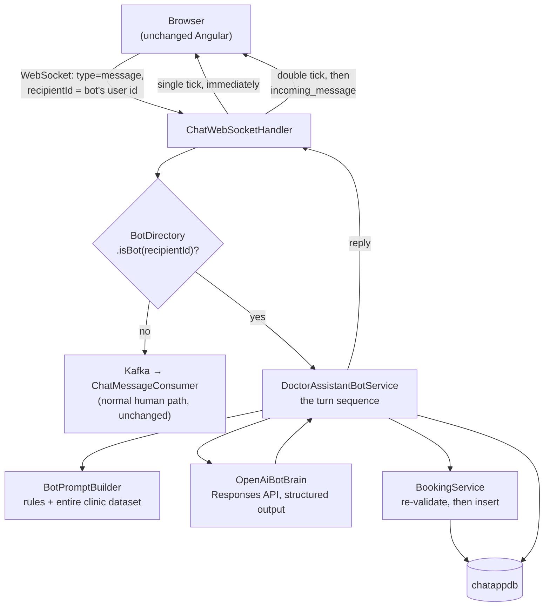
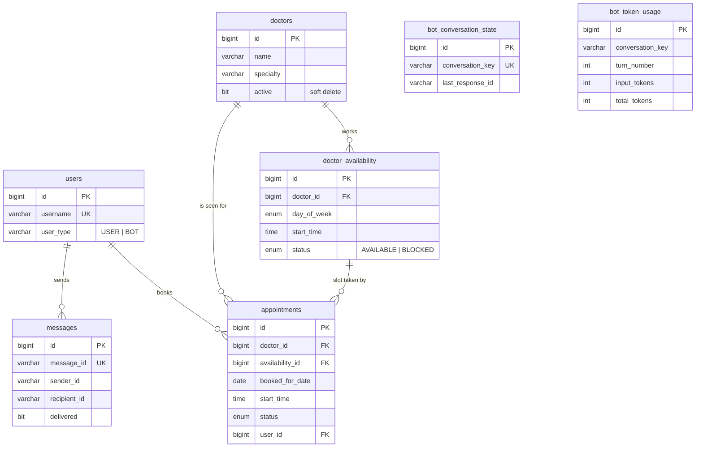

# DoctorAssistant Bot — Version 1 structure

A map of what was built, where each piece of logic lives, and how to inspect it
while it runs. The *decisions* and their reasoning are in
[`CLAUDE.md`](../CLAUDE.md) 3.9; the *requirement* is
[`bot-requirements.md`](bot-requirements.md). This file is the "where is
everything" companion to both.

---

## 1. The shape of it

The bot is a **package inside `chat-service`**, not a separate service, and it
is reached as an **ordinary chat contact**. There is no new endpoint, no new
socket path, and **no frontend code at all** — the bot is a real row in `users`
with `user_type = 'BOT'`, so the user list, the message envelope, the ticks and
conversation history all treat it as just another person.

One branch in `ChatWebSocketHandler` is the only code that knows the difference.



---

## 2. Where each responsibility lives

All paths under
`chat-service/src/main/java/com/chatapp/chatservice/`.

### The entry point

| File | What it does |
|---|---|
| `websocket/ChatWebSocketHandler.java` | The **routing branch**. Sends the single tick, asks `BotDirectory` whether the recipient is the bot, and if so runs the turn and sends the reply. Everything socket-shaped stays here. |
| `bot/BotDirectory.java` | Answers "is this recipient the bot?" on every message. Resolves the bot's id lazily and memoises it, so this is not a database round trip per message. |

### The turn

| File | What it does |
|---|---|
| `bot/DoctorAssistantBotService.java` | **The orchestrator** — the whole turn sequence in one readable method: persist the user's message → gather clinic data → call the model → act on the decision → record the response id and token cost. Never throws; a failed turn becomes an apology. |
| `bot/BotReply.java` | What comes back out: a server-generated message id and the text to send. |

### 🔑 The system prompt

| File | What it does |
|---|---|
| **`bot/BotPromptBuilder.java`** | **This is where the system prompt lives** — the single largest piece of behaviour in the feature. Two halves: `rules(...)` is the behavioural instructions (specialty mapping, listing doctors, offering alternatives, the two-turn booking, turning people away), and `data(...)` renders the entire clinic dataset as compact labelled text. |
| `bot/ClinicDataProvider.java` | Reads the four things the prompt injects, fresh every turn, uncached. |
| `bot/ClinicSnapshot.java` | The value object holding that data for one turn. |

Every rule in `rules(...)` exists because a specific failure was observed — the
comments say which. `BotPromptBuilderTest` pins the facts the model cannot work
without (ids, the closed specialty list, the date→weekday map) without pinning
the prose, so wording can be tuned without breaking tests.

### The model call

| File | What it does |
|---|---|
| `bot/BotBrain.java` | The interface. One production implementation — it exists so the turn sequence is testable without a billable call, and it is where a provider swap would land. |
| `bot/OpenAiBotBrain.java` | The actual **Responses API** call via `com.openai:openai-java`. Blocking HTTP, `store(true)`, `previous_response_id` chaining, structured output derived from `BotDecision`. |
| `bot/BotDecision.java` | **The structured-output schema.** `reply_to_user`, `action`, `availability_id`, `booked_for_date`. The SDK turns this record into a strict JSON schema, so a malformed reply cannot be produced. |
| `bot/BotAction.java` | `BOOK` or `NONE` — the only two things a turn can ask for. |
| `bot/BotTurn.java`, `bot/TokenUsage.java` | What came back: decision, response id, token counts, model. |
| `bot/BotBrainException.java`, `bot/ExpiredConversationException.java` | Failure, and the specific recoverable case of a chain OpenAI no longer retains. |

### The rules about doctors and time

| File | What it does |
|---|---|
| **`bot/AvailabilityService.java`** | **The one place free time is computed.** `free = pattern MINUS bookings`, filtered by `doctors.active` and slot status. Nothing else may express this. |
| `bot/repository/DoctorAvailabilityRepository.java` | The single three-table query behind it. |
| `bot/FreeSlot.java` | A genuinely bookable slot. Only `AvailabilityService` constructs one, so holding one means every filter passed. |
| **`bot/BookingService.java`** | **The trust boundary.** Everything here came from a model. Re-checks the slot against live data, rejects past dates and unparseable ones, inserts, and only then releases the model's confirmation text. |
| `bot/BookingOutcome.java` | Booked or not, and which message to actually send. |

### Data

| File | What it does |
|---|---|
| `bot/entity/*.java` | `Doctor`, `DoctorAvailability` (recurring weekly pattern), `Appointment` (actual bookings), `BotConversationState`, `BotTokenUsage`, plus the two status enums. |
| `bot/DoctorSeedData.java` | Seeds six demo doctors and their weekly slots on startup. Idempotent. |
| `entity/AppUser.java` | chat-service's **read-only** window onto `users` — the cross-table reach the database consolidation bought. |
| `support/ConversationKey.java` | The canonical pair key, shared with Kafka partitioning so there is one implementation. |

### Outside chat-service

| File | What it does |
|---|---|
| `user-service/.../entity/UserType.java` | `USER` / `BOT`. |
| `user-service/.../bootstrap/BotUserSeeder.java` | Creates the bot's `users` row. user-service owns that table, so it does the writing. |

---

## 3. The database

One database, `chatappdb` — `userdb` and `messagedb` were merged so the bot can
join across users, messages and clinic data in single queries (CLAUDE.md 3.5).



The two tables that carry the design's intent:

- **`doctor_availability` is a recurring WEEKLY pattern.** A `MONDAY 09:00` row
  means *every* Monday. It says nothing about bookings.
- **`appointments` is what has actually been taken out of it**, on a specific
  date. Free time is neither table — it is the subtraction.

`appointments` has a unique constraint on `(availability_id, booked_for_date)`,
which is what makes double-booking impossible even if two requests race.

### Browsing it

**Web SQL client (Adminer):**

```bash
docker compose --profile tools up -d adminer
```

Then open this URL rather than the bare one — it preselects every field except
the password:

<http://localhost:8083/?server=mysql&username=root&db=chatappdb>

Password is `root`.

**Get the System dropdown right.** Adminer's query string encodes the driver as
the parameter NAME, so `?server=mysql` means "driver `server` (MySQL/MariaDB),
host `mysql`" — which is why the link above works and a bare
`http://localhost:8083` may not. Left on **MS SQL**, Adminer connects through
FreeTDS and fails with `SQLSTATE[HY000] Unable to connect: TDS server is
unavailable or does not exist (mysql)`. That error is about the DRIVER, not the
database — the database is fine.

It sits behind a `tools` profile so a plain `docker compose up` does not start
it: it is a debugging tool, not part of the application, and it must not be in
the stack whose connection capacity the load test measures.

If `--profile tools up` fails with a container-name conflict, an Adminer
started by hand outside Compose already holds the name. Either keep using that
one (same URL shape, its own port) or drop it first:
`docker rm -f chat-app-adminer`.

**Straight from the CLI**, if that is quicker:

```bash
docker exec -it chat-app-mysql mysql -uroot -proot chatappdb
```

Three queries worth knowing:

```bash
docker exec chat-app-mysql mysql -uroot -proot chatappdb -e "SELECT d.name, d.specialty, a.day_of_week, a.start_time FROM doctor_availability a JOIN doctors d ON d.id=a.doctor_id ORDER BY d.name, a.day_of_week, a.start_time;"
```

```bash
docker exec chat-app-mysql mysql -uroot -proot chatappdb -e "SELECT a.id, d.name, a.booked_for_date, a.start_time, a.status, u.username FROM appointments a JOIN doctors d ON d.id=a.doctor_id JOIN users u ON u.id=a.user_id;"
```

```bash
docker exec chat-app-mysql mysql -uroot -proot chatappdb -e "SELECT turn_number, input_tokens, output_tokens, total_tokens, model FROM bot_token_usage ORDER BY conversation_key, turn_number;"
```

That last one is the point of Version 1 — see below.

---

## 4. What Version 1 proved

Input tokens across one four-turn conversation: **3719 → 3797 → 3862 → 3944**,
against a flat ~3400 of stuffed clinic data. So roughly **86% of every call is
the same dataset re-sent**, and the remainder climbs with conversation length.
Two compounding curves, with six doctors.

It also produced the failure that argues for tools: asked for a 10:00 slot that
was taken, the bot offered 10:30 — which was *also* in the booked list. It had
noticed one and missed the next. `BookingService` refused the booking, so
nothing was double-booked, but the caller was offered a time, agreed, and was
then told it was gone.

That is set arithmetic over stuffed data, and it is not a prompting problem.
`AvailabilityService` already computes the answer exactly, in one place — a tool
call hands the model that result instead of the raw inputs.

---

## 5. What is remaining

### Required, not built

- **Tool calling with the Responses API.** Item 2 of "the Chatbot has to be
  implemented using" in the requirement. **Version 1 does not satisfy the
  requirement without it.** It is also the fix for the availability error above.

### Deliberately deferred

| | Why it is not here |
|---|---|
| Appointment cancellation | Out of scope. Note: the unconditional unique constraint on `appointments` assumes cancelled rows never appear, so whoever adds cancellation must replace it. |
| Streaming replies | Version 1 sends one whole reply. Later: relay OpenAI's SSE chunks over the existing socket. |
| Long-term memory | `previous_response_id` gives continuity *within* a conversation, not recall across days. Real memory means storing and replaying history ourselves — with its own token cost. |
| Human-agent transfer, `AGENT` / `DOCTOR` user types | Not in the requirement. Doctors are reference data; they never log in. |
| Bedrock / provider swap | Bypassing Spring AI makes this real rewrite work against SDK-specific classes, not a config change. |
| AWS deployment of the bot | Local Docker only. |

### Rough edges worth knowing about

- **The bot cannot speak first.** Every sample conversation opens with the agent
  greeting. In a chat window the user opens the conversation, so the welcome
  rides on the bot's first *reply* instead. Matching the samples exactly would
  mean the bot posting on conversation open — a real feature, not built.
- **The model call runs inline on the WebSocket thread**, bounded by a timeout.
  Keeps turns strictly ordered; would need an executor and an answer for
  ordering if bot conversations got concurrent.
- **No admin surface.** Doctors, availability and blocked slots are seed data —
  changing them means editing `DoctorSeedData` or writing SQL.
- **Patient details are the `users` row**, via `appointments.user_id`. The
  requirement says details "may be" collected; a foreign key to the existing
  account beats re-collecting what the system already has. Nothing captures a
  reason-for-visit or phone number.
- **The expired-chain recovery path cannot be tested for real** — it needs a
  genuinely aged-out response id, which takes days. Covered by unit tests
  against a fake, and by a deliberately loose error matcher.
