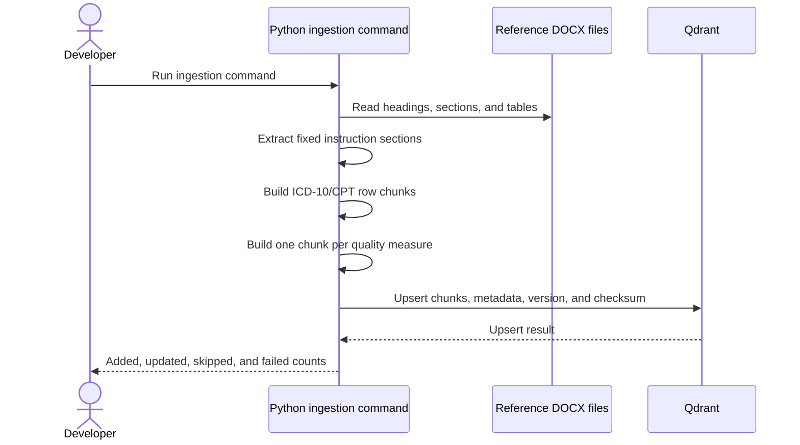
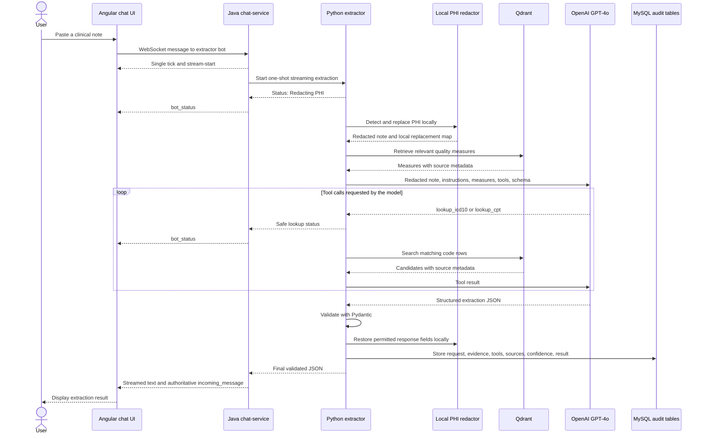

# Clinical Note Extractor — Sequence Design

The extractor is a separate Python service inside this repository. It uses the
existing chat UI and WebSocket connection, while keeping PHI processing inside
the local system.

## One-time document ingestion

The command uses stable point IDs and checksums. Running it again skips
unchanged content and updates changed content.

## One clinical note extraction

`bot_status` messages describe visible work, such as code lookup. They do not
expose the model's private reasoning. The audit trace stores concise field-level
rationale, supporting note passages, tool calls, and source references.
