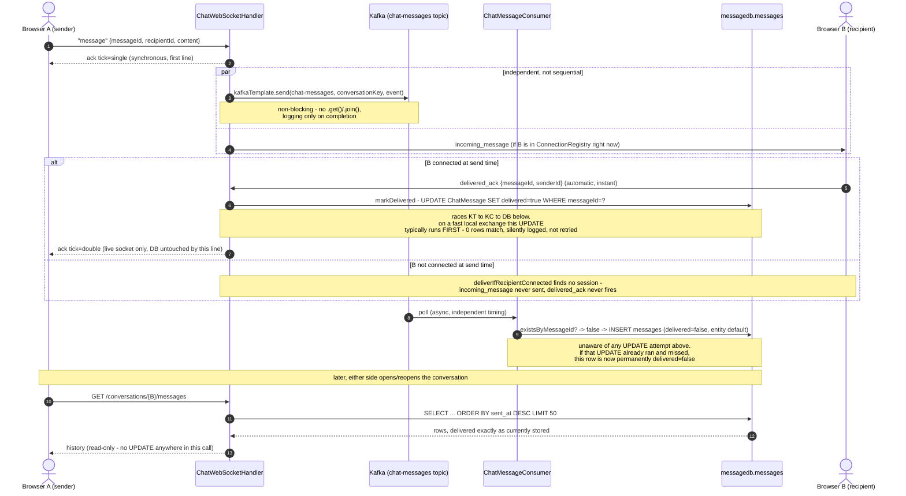

# Current message delivery flow (ground truth, as of this doc)

This documents exactly what the code does today for send → ack → persistence →
live delivery → delivered_ack → history. Nothing here is a proposal or a fix —
it's a trace of the current implementation, produced before any redesign work,
so the redesign starts from accurate ground truth instead of from what
CLAUDE.md §3.1/§3.4 say should happen.

All file references are to `chat-service/src/main/java/com/chatapp/chatservice/`
unless noted otherwise.

## 1. The instant a message arrives at chat-service

`websocket/ChatWebSocketHandler.java:193-212` (`handleChatMessage`) runs three
things, in this exact order, for every `"message"` envelope:

```java
sendSingleTickAck(session, request.messageId());        // line 209
chatMessagePublisher.publish(senderId, request);          // line 210
deliverIfRecipientConnected(senderId, request);            // line 211
```

- **Single tick is synchronous and first.** `sendSingleTickAck` writes the
  `{"type":"ack","tick":"single",...}` frame directly back on the sender's own
  session, before Kafka or the recipient are touched at all. This is the one
  ordering guarantee the method's own comment calls non-negotiable
  (`ChatWebSocketHandler.java:171-177`).
- **Kafka publish and live delivery are independent of each other**, not two
  steps of one pipeline (`ChatWebSocketHandler.java:178-186`). Neither's
  outcome affects the other: `chatMessagePublisher.publish(...)` never blocks
  on Kafka (see §2), and `deliverIfRecipientConnected(...)` only depends on
  whether `ConnectionRegistry` currently holds a live session for the
  recipient — it does not wait for or check the Kafka publish in any way.
  Swapping the two calls' order would change nothing observable, which is
  exactly what the comment says.
- Concretely: single tick can appear on the sender's screen while the Kafka
  publish call is still in flight, and while the recipient's `incoming_message`
  (if they're connected) is being written to their socket — all three are
  effectively concurrent from the moment `handleChatMessage` returns.

## 2. Kafka — topic, key, producer, consumer, what gets written

**Topic**: `chat-messages`, declared as a Spring `NewTopic` bean with 3
partitions and 1 replica (`kafka/KafkaTopicConfig.java:34-40`) — matches the
single-broker Kafka in `docker-compose.yml`.

**Producer call**: `kafka/ChatMessagePublisher.java:40-54`.

```java
kafkaTemplate.send(KafkaTopicConfig.CHAT_MESSAGES_TOPIC, key, event)
        .whenComplete((result, exception) -> { /* logging only */ });
```

- `key` is the canonical, order-independent conversation key —
  `min(senderId, recipientId) + ":" + max(senderId, recipientId)`
  (`ChatMessagePublisher.java:88-92`). Both directions of a conversation hash
  to the same partition, which is the only thing that makes Kafka's
  per-partition ordering guarantee cover the whole conversation, not just one
  sender's messages.
- `KafkaTemplate.send()` is asynchronous — it returns a `CompletableFuture`
  immediately without waiting for the broker to ack. `.whenComplete(...)` is
  attached **only for logging**; `.get()`/`.join()` is deliberately never
  called, which is what keeps this call non-blocking for the WebSocket I/O
  thread (`ChatMessagePublisher.java:18-27`).
- The value published is `kafka/ChatMessageEvent.java` — its own record
  (`messageId, senderId, recipientId, content, sentAt`), not a reuse of the
  WebSocket DTO or the JPA entity. `sentAt` is stamped at **publish** time
  (`ChatMessagePublisher.java:44`), not consume time.
- A synchronous `RuntimeException` from `kafkaTemplate.send()` itself (e.g. a
  full local send buffer) is caught and logged, never propagated
  (`ChatMessagePublisher.java:55-66`) — same "must never put the sender's
  single tick at risk" reasoning as the async failure path.

**Consumer**: `kafka/ChatMessageConsumer.java:47-65`, `@KafkaListener` on the
same topic, group id `chat-service-message-persister`
(`application.yml`'s `spring.kafka.consumer.group-id`).

```java
if (chatMessageRepository.existsByMessageId(event.messageId())) { return; } // idempotency guard
ChatMessage message = new ChatMessage(event.messageId(), event.senderId(),
        event.recipientId(), event.content(), event.sentAt());
chatMessageRepository.save(message);
```

- Writes to messagedb's **`messages`** table
  (`entity/ChatMessage.java:32`, `@Table(name = "messages")`), one row per
  message, columns `message_id` (unique), `sender_id`, `recipient_id`,
  `content`, `sent_at`, `delivered`.
- `existsByMessageId` is the idempotency guard against Kafka's at-least-once
  redelivery; the `message_id` unique constraint is the DB-level backstop
  behind it.
- **The `ChatMessage(...)` constructor used here never sets `delivered`** — it
  only takes the five fields shown above. The entity field defaults to
  `false` (`entity/ChatMessage.java:67`). Every row this consumer inserts is
  `delivered = false` at the moment it's written, unconditionally, regardless
  of whether a `delivered_ack` for that same message has already arrived (see
  §3).

## 3. The delivered_ack path, end to end — and the race

**What triggers the client to send it**: `frontend/src/app/core/chat.service.ts:108-121`.
The Angular `ChatService`'s WebSocket `message` listener checks
`parsed.type === 'incoming_message'` and, if true, calls
`this.sendDeliveredAck(parsed)` immediately, with no user action. This is the
**only** call site for `sendDeliveredAck` in the frontend
(`chat.service.ts:159-170`) — it never fires from `getHistory()`
(`chat.service.ts:81-83`), which is a plain `HttpClient.get` with no
side-effecting code around it at all.

**What the server does with it**: `websocket/ChatWebSocketHandler.java:263-296`
(`handleDeliveredAck`), two steps, deliberately unconditional on each other:

```java
chatMessageService.markDelivered(ack.messageId());        // line 277 — always runs

Optional<WebSocketSession> senderSession = connectionRegistry.find(ack.senderId());
if (senderSession.isEmpty()) { return; }                    // live tick dropped if sender gone
// ...else send TickAck.doubleTick(ack.messageId()) to the sender's live socket
```

`markDelivered` (`service/ChatMessageService.java:143-150`) runs a single
bulk update, `repository/ChatMessageRepository.java:79-82`:

```java
@Modifying
@Transactional
@Query("UPDATE ChatMessage m SET m.delivered = true WHERE m.messageId = :messageId")
int markDelivered(@Param("messageId") String messageId);
```

A direct bulk `UPDATE` rather than load-entity-then-`save()`, and it returns
the row count specifically so the caller can detect the zero-rows case
(`ChatMessageRepository.java:71-77` — the repository's own comment already
names this exact race).

**Exactly why this races the Kafka consumer**: the `delivered_ack` path and
the Kafka persistence path are two physically different round trips with no
coordination between them:

- `delivered_ack` round trip: recipient's browser → chat-service (socket) →
  `handleDeliveredAck` → `UPDATE`. No Kafka hop at all.
- Kafka persistence round trip: `handleChatMessage` → `kafkaTemplate.send()`
  → broker write → consumer poll → `existsByMessageId` check → `INSERT`.

Because the first path is shorter and has no broker round trip, it routinely
completes **before** the row referenced by `UPDATE ... WHERE message_id = ?`
exists yet. That `UPDATE` matches zero rows. `ChatMessageService.markDelivered`
checks `rowsUpdated == 0` and only logs it (`ChatMessageService.java:144-149`)
— there is no retry, no queue, no second attempt. When the consumer's
`INSERT` runs moments later (§2), it writes `delivered = false` from the
entity default, with no awareness that an `UPDATE` already tried and missed.
**Nothing afterward ever revisits that row** — this is a one-shot, and once
missed, the `delivered` column is permanently `false` for that message, even
though the live double-tick genuinely reached the sender's screen in that
moment (`ChatWebSocketHandler.java:286-288`, which never touches the
database).

Verified empirically during this feature's own manual testing
(Docker-containerized and native `bootRun`, both pointed at the same
Dockerized MySQL/Kafka): on a fast local exchange this is the **typical**
outcome for a promptly-acking recipient, not a rare corner case.

## 4. What `GET /conversations/{otherUserId}/messages` does and does not do

`controller/ConversationController.java:74-100` → one call:
`chatMessageService.getConversationHistory(currentUserId, otherUserId)`
(line 98) → `service/ChatMessageService.java:83-102`.

```java
Pageable mostRecentFirst = PageRequest.of(0, HISTORY_LIMIT, Sort.by("sentAt").descending());
List<ConversationMessageResponse> descending = chatMessageRepository
        .findConversationMostRecentFirst(currentUserId, otherUserId, mostRecentFirst)
        .stream().map(ConversationMessageResponse::from).toList();
// reversed in memory to oldest-first, then returned
```

- **Does**: a single `SELECT ... ORDER BY sent_at DESC LIMIT 50`
  (`ChatMessageRepository`'s `findConversationMostRecentFirst`), reversed in
  memory to oldest-to-newest, mapped straight through to
  `ConversationMessageResponse.delivered` (`dto/ConversationMessageResponse.java`),
  which is a direct passthrough of `ChatMessage.isDelivered()`.
- **Does not**: call `markDelivered`, run any `UPDATE`, or otherwise mutate
  `messages` in any way. There is no other method call in
  `getConversationHistory` besides the repository read and the in-memory
  reverse. `ConversationController` calls no other `ChatMessageService`
  method (`ConversationController.java` has exactly one `@GetMapping`, no
  other endpoints).
- **Consequence**: the `delivered` value returned by this endpoint is exactly
  whatever is currently stored in the row — permanently `false` for any
  message that lost the race in §3, regardless of how many times the
  conversation is re-fetched.

## Sequence diagram



## Where this drifts from CLAUDE.md §3.1 / §3.4

Nothing in §3.1 or §3.4 is factually **wrong** about the live tick behavior —
the single-tick-before-anything-else ordering, the independence of Kafka
publish from delivery attempt, and the "double tick fires only after the
recipient's client acknowledges" description all match the code exactly as
written.

What's missing from both sections, because both predate the message-history
feature that added it: **neither section mentions that delivery status is now
also a persisted database fact** (`messages.delivered`), or that this
persisted fact can silently diverge from the live tick the sender's screen
showed. As written, §3.1/§3.4 describe "double tick" as if it were one
consistent thing. In the current code it is actually two independent
mechanisms that usually, but not always, agree:

1. the **live** tick (`TickAck` over the open socket — always correct in the
   moment, never touches the DB), and
2. the **persisted** flag (`messages.delivered` — subject to the race in §3,
   frequently stuck at `false` even when (1) fired correctly).

This distinction is documented today only in `ChatMessageService.markDelivered`'s
Javadoc and in CLAUDE.md §4 (the `GET /conversations` entry), not in §3.1 or
§3.4 themselves — someone reading only the protocol/persistence sections would
come away believing double-tick is a single durable fact, which is no longer
accurate now that history can be fetched later and read a different answer
than what was shown live.
