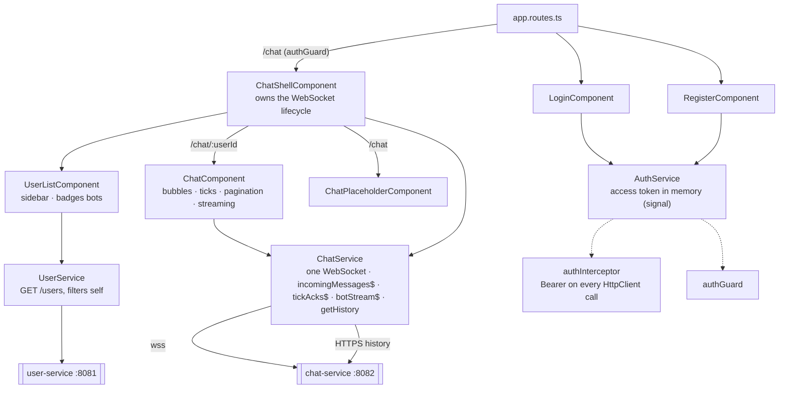
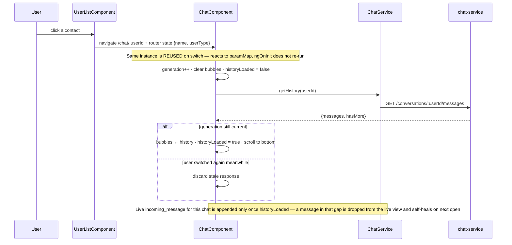
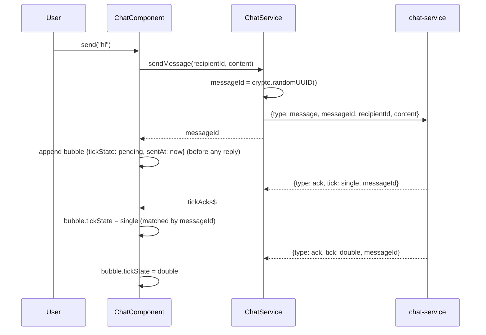
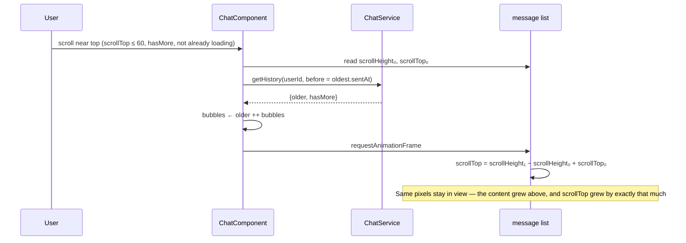
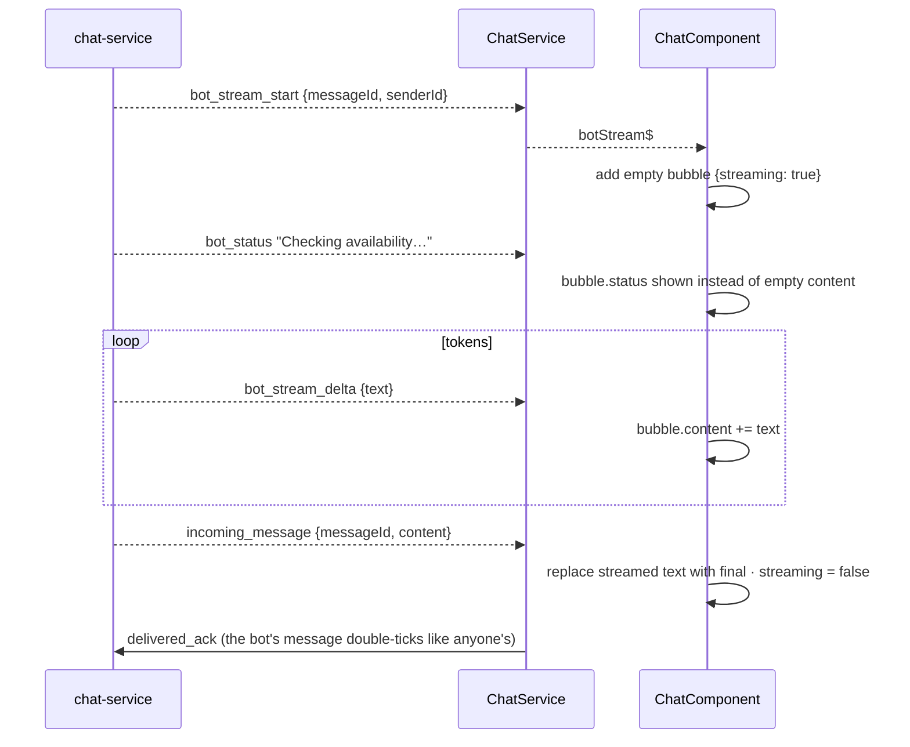

# frontend

The Angular 22 single-page app: register, log in, a WhatsApp-style split view,
live messaging with ticks, scroll-back history, and the two DoctorAssistant
bots as ordinary contacts. Standalone components, signals for state, RxJS for
the WebSocket streams. Served by the Angular dev server on `:4200` in Docker;
in production a static build on S3 behind CloudFront.

Design notes: [`CLAUDE.md`](../CLAUDE.md) build-order steps 7, 13, 16–17, 19.

## Structure



| Folder | Holds |
|---|---|
| `core/` | `AuthService` (login/logout, token as a signal, `currentUserId()` from the JWT), `ChatService` (the socket + history), `UserService`, `authInterceptor`, `authGuard`, `api-config` (env-switched base URLs) |
| `features/login`, `features/register` | Forms |
| `features/chat-shell` | The split view: persistent sidebar + `<router-outlet>`; connects the socket on entry, disconnects on leaving `/chat` |
| `features/user-list` | Sidebar; forwards the recipient's name and user type through router state so the chat header needs no second lookup |
| `features/chat` | The conversation: history, live messages, ticks, scroll-back, bot streaming |
| `models/` | The wire shapes — mirrors chat-service's DTOs |

Routes: `/login`, `/register`, `/chat` (guarded) with children `''`
(placeholder) and `:userId`; `/users` redirects to `/chat`.

## Sequence diagrams

### Login, and what holds the token

```mermaid
sequenceDiagram
    participant U as User
    participant LC as LoginComponent
    participant AS as AuthService
    participant USvc as user-service
    participant AG as authGuard
    U->>LC: submit
    LC->>AS: login(username, password)
    AS->>USvc: POST /login
    USvc-->>AS: {accessToken, refreshToken}
    AS->>AS: accessToken signal ← token  (memory only — gone on page reload)
    LC->>AG: navigate /chat
    AG->>AS: accessToken() present?
    AG-->>LC: allow
    Note over AS: authInterceptor adds Bearer to every HttpClient call from here
    Note over AS,USvc: Refresh is built server-side; the client does not call POST /refresh yet (step 13)
```

### Opening a conversation — history first, then live



### Sending a message — optimistic bubble, then ticks



When a message *arrives*, `ChatService` sends `delivered_ack` automatically
before the component ever sees it — that is what produces the other side's
double tick, with no user action.

### Scrolling back — prepend without the view jumping



### A streamed bot reply



Only the tool-calling bot streams; V1 arrives as a single `incoming_message`.
The tick pair means something different in a bot chat — single: the bot has
your message; double: the bot has answered — so the single tick sits for
exactly as long as the model is thinking.

## Running and testing

```bash
docker compose up -d frontend              # dev server on :4200, source bind-mounted, hot reload
npx ng build --configuration production    # what CI ships to S3 (needs Node 24)
```

`src/environments/` switches the API base URLs: `localhost:8081/8082` in dev,
`api.sarthak-chat-app.beer` in production. There are no frontend unit tests
yet; behaviour is verified through the backend suites and in-browser checks.
