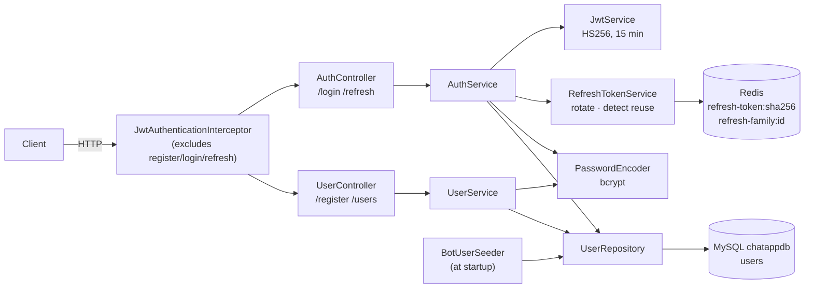
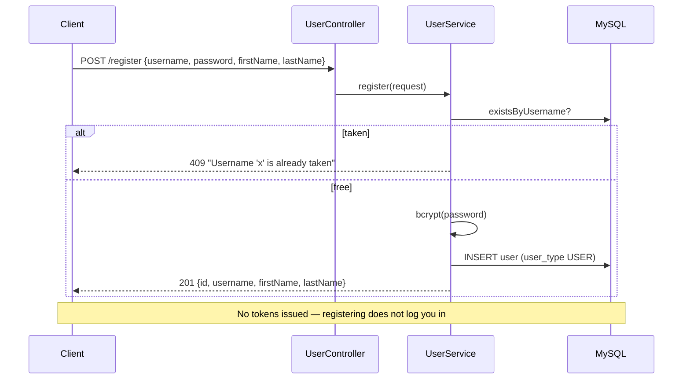
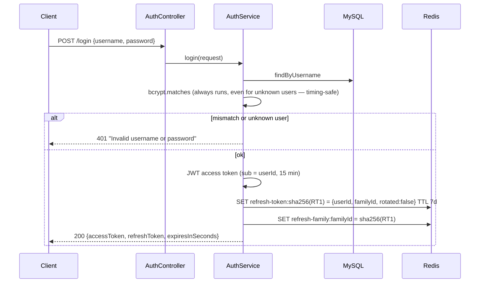
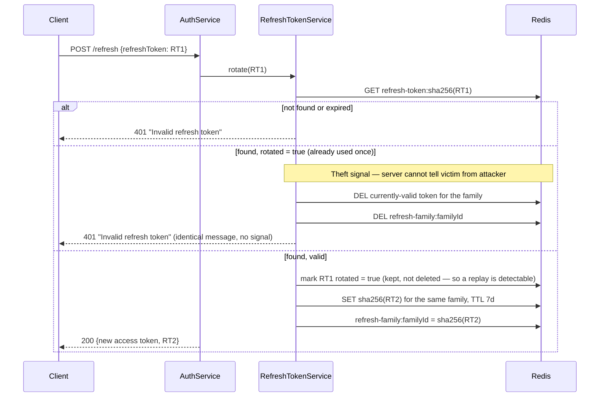
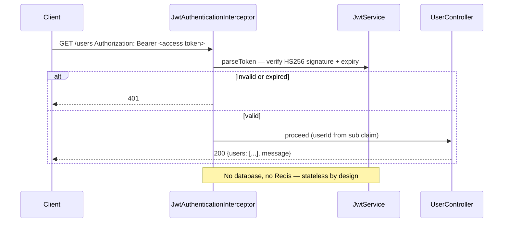

# user-service

The identity service: register, log in, refresh, list users. **Stateless
HTTP** — it holds nothing in memory between requests, so any instance can serve
any request. It is the **only writer** to the `users` table (chat-service reads
it, never writes) and the only issuer of tokens.

Port `8081` locally (`8080` inside the container). Full design reasoning:
[`CLAUDE.md`](../CLAUDE.md) §3.2 (boundaries), §3.3 (auth).

## Endpoints

| Method | Path | Auth | Does |
|---|---|---|---|
| `POST` | `/register` | none | Create a user; `400` on missing fields, `409` on a taken username |
| `POST` | `/login` | none | Verify credentials; issue access + refresh token pair |
| `POST` | `/refresh` | refresh token in body | Rotate the refresh token; issue a fresh pair |
| `GET` | `/users` | `Bearer` access token | Every user (including bots and the caller — the frontend filters itself out) |
| `GET` | `/actuator/health` | none | Liveness incl. MySQL + Redis |

Everything not in the exclusion list (`/register`, `/login`, `/refresh`,
`/actuator/**`) is guarded by `JwtAuthenticationInterceptor` — deny by
default, so an endpoint added later is protected without remembering to.

## Architecture



| Package | Holds |
|---|---|
| `controller` | `AuthController`, `UserController` — HTTP in, DTO out, nothing else |
| `service` | `AuthService` (login, refresh), `UserService` (register, list) |
| `security` | `JwtService` (mint/parse), `RefreshTokenService` (Redis registry), `JwtAuthenticationInterceptor` |
| `entity` / `repository` | `User` + `UserType` (`USER`, `BOT`, `BOT_TOOL`), `UserRepository` |
| `bootstrap` | `BotUserSeeder` — idempotently seeds the two bot users at boot with an unloginnable password |
| `config` | `PasswordEncoderConfig`, `WebMvcConfig` (interceptor registration + CORS) |
| `exception` | `GlobalExceptionHandler` → `400` / `401` / `409` with an `ErrorResponse` body |

## Sequence diagrams

### Register



### Login — two tokens, two jobs



The access token is a signed JWT: verified by signature alone, no lookup,
which is why it must expire quickly — nothing can revoke it early. The
refresh token is 256 random bits, stored only as its SHA-256, and checked
against Redis on every use — which is exactly what makes it revocable.

### Refresh — rotation, and what a replay triggers



### An authenticated request



## Running and testing

```bash
docker compose up -d user-service          # from the repo root; needs mysql + redis
./gradlew test                             # 34 tests: controllers (MockMvc), services, JWT, refresh rotation + reuse
```

Configuration is `${ENV_VAR:default}` in `src/main/resources/application.yml`;
`JWT_SECRET` must be byte-identical to chat-service's, which docker-compose
guarantees with a shared YAML anchor.
